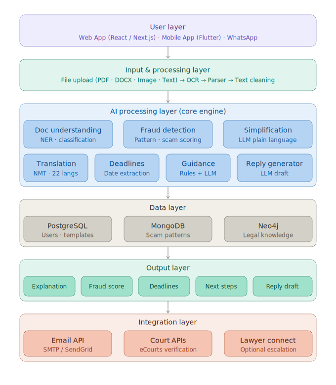

#  NyaayAI — AI-Powered Legal Understanding & Fraud Detection System

> *Justice shouldn't be a privilege. It should be a right.*
> “People are not afraid of the law — they are afraid of not understanding it.”

NyaayAI is a privacy-first, AI-powered legal assistant that helps users understand, verify, and act on legal documents with confidence.

From confusing legal notices to potential frauds, NyaayAI transforms complex documents into clear insights and actionable guidance — all within a secure and intelligent pipeline.

[](https://sdgs.un.org/goals/goal16)
[]()
[]()
[]()

---

## The Problem

India's legal system is in crisis — and ordinary citizens bear the cost.

| Statistic | Reality |
|-----------|---------|
| Pending cases in India | **5.02+ crore** |
| Average case resolution time | **3–25 years** |
| Annual economic loss from unresolved disputes | **₹8.1 lakh crore** |
| Citizens who cannot afford legal services | **80%+** |
| Citizens who speak English | **Only 10.6%** |
| Women who abandon legal cases | **3x more likely** |

> Most people don't lose legal battles in court — they lose them before they ever begin.
> Legal documents today are:

1.Difficult to understand due to complex language

2.Easily misused for fraud and scams

3.Lacking clear guidance for common people

4.Dependent on expensive legal consultation
The real problem is lack of accessible legal understanding.

---

## What is NyaayAI?

**NyaayAI** is a free, AI-powered legal aid platform that helps everyday Indians:

- **Understand** complex legal documents (FIRs, notices, summons) in plain language
- **Detect** fake/fraudulent legal notices before falling victim
- **Know** their deadlines, rights, and next steps — instantly
- **Draft** legally-informed reply letters with AI assistance
- **Access** everything in Hindi, Marathi, and 20+ regional languages
  

---

## Key Features

```
 AI Document Understanding     →  Upload FIR / Notice / Summons → instant plain-language summary
 Fake Notice Detector          →  Fraud risk score: Genuine / Suspicious / Fraud
 Deadline & Action Extractor   →  Never miss a critical legal date again
 AI Reply Draft Generator      →  Auto-generate legally-sound response letters
 Multilingual Support          →  Hindi, Marathi + 20 Indian languages via NMT
 Case Outcome Predictor        →  Prediction based on 10 lakh+ historical judgments
 Legal Aid Locator             →  Find nearest NALSA centres instantly
 Privacy First                 →  End-to-end encryption + auto-delete processing
```

---

##  Architecture Overview


---

##  Tech Stack

| Layer | Technology |
|-------|-----------|
| Frontend | React.js, Next.js |
| Backend | Node.js (Express), FastAPI |
| AI / NLP | Ollama (Local LLM) / Claude LLMs, Tesseract OCR, spaCy NER |
| Translation | Neural Machine Translation (Indic NLP) |
| Databases | PostgreSQL, MongoDB |
| Auth | JWT / OAuth 2.0 |
| Cloud | AWS |
| APIs | eCourts API, NALSA, SendGrid|

---

##  Who It's For

| User | How NyaayAI Helps |
|------|------------------|
|  Rural & Low-Income Users | Understand legal docs in regional language; avoid scams |
|  First-Time Legal Users | Clear next steps, deadlines, no confusion |
|  General Public | Save time & legal costs; verify documents instantly |
|  Legal System & Government | Reduce court burden; manage 4.7+ crore pending cases |
|  Students & Youth | Build legal awareness; learn rights the easy way |

---

##  SDG Alignment

| Goal | How NyaayAI Contributes |
|------|------------------------|
|  **SDG 16** — Peace, Justice & Strong Institutions | Direct access to justice for all |
|  **SDG 10** — Reduced Inequalities | Free legal aid for underserved populations |
|  **SDG 1** — No Poverty | Reduces ₹8.1L crore economic loss from unresolved disputes |
|  **SDG 5** — Gender Equality | Empowers women who are 3x more likely to abandon cases |
|  **SDG 9** — Innovation & Infrastructure | AI-powered access where <2% use eCourts today |

---
## 🚀 How to Run Frontend

npm install
npm run dev

##  Privacy & Safety

-  End-to-end encryption on all document uploads
-  Auto-delete after processing — no data retained
-  No personal data sold or shared
-  Compliant with Indian IT Act data protection guidelines

---

##  Team Avinya

| Member | Role |
|--------|------|
| Parthavi Wadhawane | System Architecture & Backend |
| Shraddha Bhujbal | AI/NLP  |
| Sakshi Kawade | Backend Development |
| Srushti Navale | Frontend Development |

---

##  References

1. M. Wahab, "Challenges Afflicting Indian Courts," 2024
2. M. B. Micevska & A. K. Hazra, "Court Congestion in Indian Lower Courts," 2004
3. Perallis Security, "Fake Legal Notice Scam," 2019
4. NJDG — National Judicial Data Grid, eCourts.gov.in, 2024
5. United Nations, SDG 16, sdgs.un.org, 2025
6. A. Arif, "Judicial Backlog," Outlook India, Dec 2025
7. P. Bhattacharya, "What is jamming the wheels of justice?," Mint, Apr 2025

---

<div align="center">

**⚖️ NyaayAI — Because everyone deserves to understand their rights.**

*Free. Multilingual. AI-Powered. Built for Bharat.*

</div>
